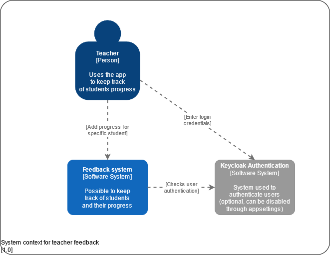
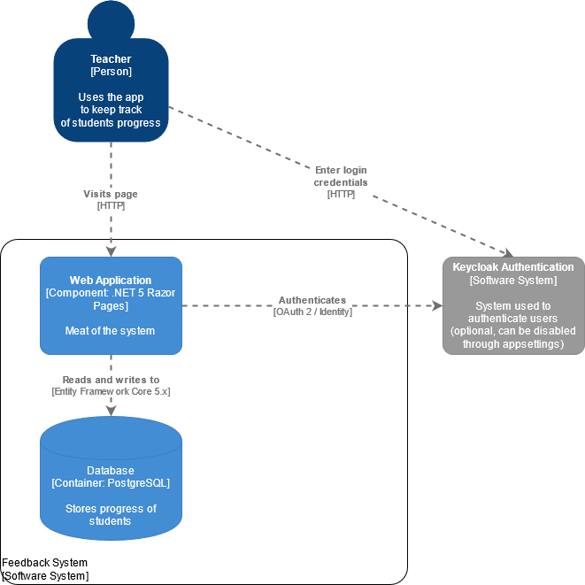
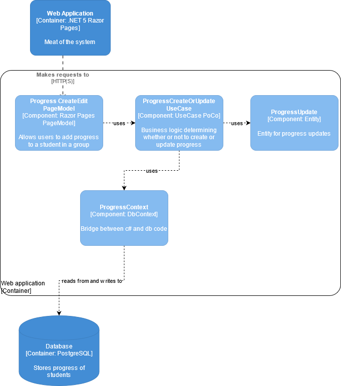

# Student Progress

[](http://83.81.134.165:8080/timohermans/StudentProgress)

Project to track people, whether that's students, team members or yourself.

## Feature showcase


## Installation
To run the project, execute the following command in this folder:

```bash
docker-compose up -d
```
The app will be available on `http://localhost:80`. The app and database will keep running **until you stop with `docker-compose down` or using the GUI**


To build new changes into the running docker image, execute the following command:
```bash
docker-compose up -d --build
```

## Config

Project works out of the box. You can, however, change a couple of variables

> Change these values in the [docker-compose.yml](docker-compose.yml) file if necessary

### Port

By default the port is 80. See `ports` in the `student-progress` service

### Database

By default the docker-compose spins up a PostgreSQL instance.
You can use your own PostgreSQL instance by adding and/or changing the following environment variables on the `student-progress` service:

> Note that you cannot use a different database provider for now, because I've used Dapper for several queries

- DB_HOST
- DB_PORT
- DB_USERNAME
- DB_PASSWORD
- DB_DATABASE

## Development

### Migrations

To apply migrations:

```bash
dotnet ef database update --startup-project "./StudentProgress.Web/StudentProgress.Web.csproj" --project="./StudentProgress.Core/StudentProgress.Core.csproj"
```

To add migrations:

```bash
dotnet ef migrations add InitialCreate --startup-project "./StudentProgress.Web/StudentProgress.Web.csproj" --project="./StudentProgress.Core/StudentProgress.Core.csproj"
```

To remove migrations:

```bash
dotnet ef migrations remove --startup-project "./StudentProgress.Web/StudentProgress.Web.csproj" --project="./StudentProgress.Core/StudentProgress.Core.csproj"
```

### Integration tests

Integration tests are done through a real database.
Please be advised with using integration tests:

- Only create 2 tests for a usecase:
    - One for the longest happy path
    - One failure test. Preferrably the longest, but any will do.
- One exception to this rule is when there are a lot of database specific constraints, like db uniqueness

Creating a new integration test file is easy:

- Add a new class
- Add the attribute `[Collection("db")]` above the class definition
- Implement abstract class `DatabaseTests`
- You will have to add the constructor: `public <ClassName>(DatabaseFixture fixture) : base(fixture) {}`
- You now have access to the `Fixture` property

### Unit Tests

Test are written using [xUnit](https://xunit.net/docs/shared-context)

Assertions are done with [Fluent assertions](https://fluentassertions.com/)

These combined, a test looks like this:

```csharp
[Fact]
public void Name_cannot_be_empty() {
    var name = Name.Create("");
    
    name.IsSuccess.Should().BeFalse();
} 
```

## Technical design

I've used a combination of C4 and abstract class diagram to highlight the most important parts of the technical design.
Find more information about the [c4 model here](https://www.c4model.com).

## Context Diagram



Note that the authentication can be disabled alltogether in the `appsettings.Development.json` or the environment variables.

## Container Diagram



Documentation on the different technologies used can be found below:

- [.NET 5 Razor Pages](https://docs.microsoft.com/en-us/aspnet/core/razor-pages/?view=aspnetcore-5.0&tabs=visual-studio)
- [Authentication with OpenIDConnect](https://docs.identityserver.io/en/release/quickstarts/3_interactive_login.html#creating-an-mvc-client)
- [Entity Framework Core 5.x](https://docs.microsoft.com/en-us/ef/core/)
- [Keycloak documentation](https://www.keycloak.org/documentation)
- [PostgreSQL documentation](https://www.postgresql.org/docs/12/index.html)
- [Postgresql Npgsql Entity Framework Core Provider (the nuget package that makes Postgres work with EF)](https://www.npgsql.org/efcore/)

## Component Diagram

To keep the diagram simple, only the creation or updating of a Progress entity has been modeled.
However, you can apply the same principle to all entities (see Domain model for more info)



For each component some additional explanation is warranted:

### Progress CreateEdit PageModel

This component is nothing more than a PageModel that you're used to from Razor Pages. Each PageModel is set up in either one of the following two ways:

- `ProgressContext` class for GET and a `UseCase` class for POST/PUT
- `UseCase` class for GET and a `UseCase` class for POST/PUT

The reason not all GET requests have a seperate UseCase class is either I've been too lazy to create one or it was a very simple query that could be solved with Entity Framework.

A PageModel shouldn't be doing anything else except input validation and passing info to the UseCase classes.

### ProgressCreateOrUpdateUseCase

UseCase classes are the meat of the system. They (should) contain all domain and business logic.

Every UseCase class is **always** accompanied by the following three components:

- `Request` or `Command` class (depending on whether it's a GET or a POST)
- A `Result` class
- A `HandleAsync` method that accepts either the `Request` or `Command` class in the same file

This architectural principle has been heavily inspired from [Jimmy Bogard's Vertical Slice Architecture](https://www.youtube.com/watch?v=T6nglsEDaqA).
There are, however, some notable differences:

- The package `MediatR` hasn't been used. The reason for this is simply because I didn't see the need for this. I wanted tight coupling between PageModels and UseCases to make the application as simple as possible
- I also haven't made use of any IoC/DI apart from the `ProgressContext`. The reason for this is simplicity as well. Integration tests are the most important part of a CRUD application and thus you don't need much - if any at all - interfaces or mockery for the application. This choice is heavily inspired by [Vladimir Khorikov's book Unit Testing: Principles, Practices and Patterns](https://enterprisecraftsmanship.com/)

Finally, you might notice I've made a lot of use of the [CSharpFunctionalExtensions Nuget package](https://github.com/vkhorikov/CSharpFunctionalExtensions). This is also heavily inspired by Vladimir Khorikov, but also my love for functional programming.

### ProgressContext

In almost every UseCase Entity Framework is used to query or mutate the database.
There is, however, a notable exception when retrieving StudentGroup details.
For this I've used [Dapper](https://dapperlib.github.io/Dapper/).
The reason I used Dapper for this is that I wanted to test Dapper and because it's quite a hefty query to perform.

## Domain model

See below the domain model of all the entities.
Note that the ValueObjects and enums have been omitted to keep the model as simple as possible.


