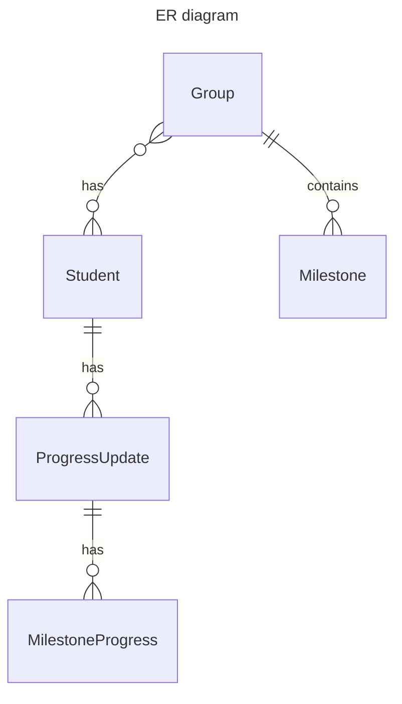

# Student Progress

Project to track people, whether that's students, team members or yourself.

## Table of contents

- [Student Progress](#student-progress)
  - [Table of contents](#table-of-contents)
  - [Todo](#todo)
  - [Resources](#resources)
  - [Architecture migration notes](#architecture-migration-notes)
  - [Feature showcase](#feature-showcase)
  - [Installation](#installation)
    - [Run migrations](#run-migrations)
    - [Dotnet](#dotnet)
    - [Docker](#docker)
  - [Config](#config)
    - [Database](#database)
    - [Production](#production)
  - [Development](#development)
    - [Migrations](#migrations)
    - [Integration tests](#integration-tests)
    - [Unit Tests](#unit-tests)
  - [Technical design](#technical-design)
    - [Context Diagram](#context-diagram)
    - [Container Diagram](#container-diagram)
    - [Component Diagram](#component-diagram)
      - [Progress CreateEdit PageModel](#progress-createedit-pagemodel)
      - [ProgressCreateOrUpdateUseCase and ProgressUpdate](#progresscreateorupdateusecase-and-progressupdate)
    - [Domain model](#domain-model)
      - [Entity relationships](#entity-relationships)

## Todo

- Change the search test to the page test. Remove leftover code from Core.
- Use the Linkgenerator more (check index and everywhere where htmx is used)
- Move the htmx partial pages to their `parts` folders
- Make an inline edit function for adventure
- Write something about parts in the readme
- Integrate [lowercase urls](https://www.learnrazorpages.com/razor-pages/routing#other-routing-options)
- Start working on the details page
- Prolly need to add progress and milestones to the mix as well when I start

## Resources

- [Result class usage](https://josef.codes/my-take-on-the-result-class-in-c-sharp/)
- [Entity Framework docs](https://learn.microsoft.com/en-us/ef/core/get-started/overview/first-app?tabs=netcore-cli)
- [ASP.NET core documentation](https://learn.microsoft.com/en-us/aspnet/core/introduction-to-aspnet-core?view=aspnetcore-7.0)
- [Learn RazorPages (straightforward 3rd party docs)](https://www.learnrazorpages.com)
- [Htmx docs](https://htmx.org/docs)
- [Htmx book for recipes](https://hypermedia.systems/more-htmx-patterns/)

## Architecture migration notes

Starting from now (2023-10-12), it should be encouraged to remove all traces of `Core` and `ProgressContext` from the
system and their tests.
This means that some boyscouting is to be done.
When working on a page:

- start actively working on removing `ProgressContext`,
- add to `WebContext`
- add `htmx` where possible to make it fancy
- (optional) start including more Bootstrap 5.3 (especially with css variables)

## Feature showcase


## Installation

The project can be run with either dotnet itself or docker.
It is recommended to run dotnet for development usecases and docker when runnen in production.

### Run migrations

Before you're able to run the application, you have to apply migrations. See the [Development](#migrations) section for more instructions.

### Dotnet

To run the project, execute the following command in the `StudentProgress.Web` folder:

```shell
dotnet run
```

or open the solution in an IDE and start from there.

### Docker

To run the project, execute the following command in this folder:

```bash
docker-compose up -d
```

The app will be available on `http://localhost:80`. The app and database will keep running **until you stop with `docker-compose down` or using the GUI**

To build new changes into the running docker image, execute the following command:

```bash
docker-compose up -d --build
```

## Config

To make the project run, you are required to initially put `Auth0` config values in the `appsettings.Development.json`.
This appsettings file can be copied from `appsettings.Development.example.json`.

### Database

There is no database configuration changes required, as the project uses Sqlite3 with EntityFramework.
You can, however, change the path of the database file in the `appsettings`.json

### Production

TODO

## Development

### Migrations

To apply migrations:

```bash
dotnet ef database update --startup-project "./StudentProgress.Web/StudentProgress.Web.csproj" --project="./StudentProgress.Core/StudentProgress.Core.csproj"
```

To add migrations:

```bash
dotnet ef migrations add InitialCreate --startup-project "./StudentProgress.Web/StudentProgress.Web.csproj" --project="./StudentProgress.Core/StudentProgress.Core.csproj"
```

To remove migrations:

```bash
dotnet ef migrations remove --startup-project "./StudentProgress.Web/StudentProgress.Web.csproj" --project="./StudentProgress.Core/StudentProgress.Core.csproj"
```

### Integration tests

Integration tests are done through a real database.
Please be advised with using integration tests:

- Only create 2 tests for a usecase:
  - One for the longest happy path
  - One failure test. Preferrably the longest, but any will do.
- One exception to this rule is when there are a lot of database specific constraints, like db uniqueness

Creating a new integration test file is easy:

- Add a new class
- Add the attribute `[Collection("db")]` above the class definition
- Implement abstract class `DatabaseTests`
- You will have to add the constructor: `public <ClassName>(DatabaseFixture fixture) : base(fixture) {}`
- You now have access to the `Fixture` property

### Unit Tests

Test are written using [xUnit](https://xunit.net/docs/shared-context)

Assertions are done with [Fluent assertions](https://fluentassertions.com/)

These combined, a test looks like this:

```csharp
[Fact]
public void Name_cannot_be_empty() {
    var name = Name.Create("");

    name.IsSuccess.Should().BeFalse();
}
```

## Technical design

I've used a combination of C4 and abstract class diagram to highlight the most important parts of the technical design.
Find more information about the [c4 model here](https://www.c4model.com).

### Context Diagram


Note that the authentication can be disabled alltogether in the `appsettings.Development.json` or the environment variables.

### Container Diagram


Documentation on the different technologies used can be found below:

- [.NET 5 Razor Pages](https://docs.microsoft.com/en-us/aspnet/core/razor-pages/?view=aspnetcore-5.0&tabs=visual-studio)
- [Authentication with OpenIDConnect](https://docs.identityserver.io/en/release/quickstarts/3_interactive_login.html#creating-an-mvc-client)
- [Entity Framework Core 5.x](https://docs.microsoft.com/en-us/ef/core/)
- [Keycloak documentation](https://www.keycloak.org/documentation)
- [PostgreSQL documentation](https://www.postgresql.org/docs/12/index.html)
- [Postgresql Npgsql Entity Framework Core Provider (the nuget package that makes Postgres work with EF)](https://www.npgsql.org/efcore/)

### Component Diagram

To keep the diagram simple, only the creation or updating of a Progress entity has been modeled.
However, you can apply the same principle to all entities (see Domain model for more info)


For each component some additional explanation is warranted:

#### Progress CreateEdit PageModel

This component is nothing more than a PageModel that you're used to from Razor Pages. Each PageModel communicates with the business logic in either one of the following two ways:

- A `ProgressContext` class for retrieving data and a `UseCase` class for persisting data
- A `UseCase` class for retrieving data and a `UseCase` class for persisting data

The reason not all data retrieval has a seperate UseCase class is either I've been too lazy to create one or it was a very simple query that could be solved with Entity Framework.
**You should always aim to put everything in UseCase classes**

A PageModel shouldn't be doing anything else except input validation and passing info to the UseCase classes.

#### ProgressCreateOrUpdateUseCase and ProgressUpdate

UseCase classes are the meat of the system. They (should) speak to entities and persist data to the database.

Note that this application does not have a lot of business logic. However, I've tried to put all business logic in the entity classes and value objects.

Every UseCase class is **always** accompanied by the following three components:

- `Request` or `Command` class (depending on whether it's a GET or a POST)
- A `Result` class
- A `HandleAsync` method that accepts either the `Request` or `Command` class in the same file

This architectural principle has been heavily inspired from [Jimmy Bogard's Vertical Slice Architecture](https://www.youtube.com/watch?v=T6nglsEDaqA).
There are, however, some notable differences:

- The package `MediatR` hasn't been used. The reason for this is simply because I didn't see the need for this. I wanted tight coupling between PageModels and UseCases to make the application as simple as possible
- I also haven't made use of any IoC/DI apart from the `ProgressContext`. The reason for this is simplicity as well. Integration tests are the most important part of a CRUD application and thus you don't need much - if any at all - interfaces or mockery for the application. This choice is heavily inspired by [Vladimir Khorikov's book Unit Testing: Principles, Practices and Patterns](https://enterprisecraftsmanship.com/)

Finally, you might notice I've made a lot of use of the [CSharpFunctionalExtensions Nuget package](https://github.com/vkhorikov/CSharpFunctionalExtensions). This is also heavily inspired by Vladimir Khorikov, but also my love for functional programming.

### Domain model

See below the domain model of all the entities.
Note that the ValueObjects and enums have been omitted to keep the model as simple as possible.


#### Entity relationships

Below contains a Mermaid ER diagram of the functional relationships. The reason I call it functional is, because I intentionally left out the relationsihops that might clutter the diagram. For example, `ProgressUpdate` also has a relationship with `Group`. Another example is that `MilestoneProgress` has relationships to `Milestone` and `Group`. Though again, this will only confuse the reader.

A MilestoneProgress cannot live without a ProgressUpdate


